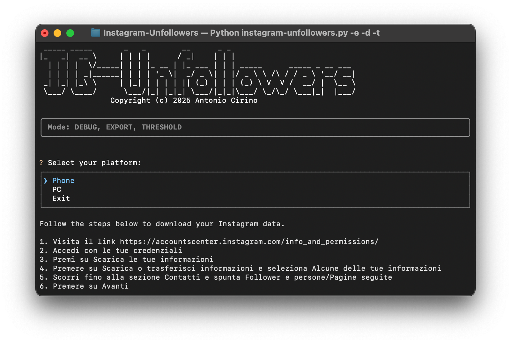

# Instagram Unfollowers
Instagram Unfollower is a tool that helps you identify users who do not follow you back on Instagram. This tool is designed to help you manage your Instagram followers more effectively.



## Features
- Identify users who do not follow you back
- Simple and easy-to-use interface
- Guided procedure
- No authentication required
- Results exporting
- Filter out users based on their followers count

## Installation
1. Clone the repository:
    ```bash
    git clone https://github.com/antocirino/Instagram-Unfollowers/
    ```
2. Navigate to the project directory:
    ```bash
    cd Instagram-Unfollowers
3. Install the required dependencies:
    ```bash
    python3 -m pip install -r requirements.txt
    ```

## Usage
1. Run the tool:
    ```bash
    python3 instagram-unfollowers.py [-h] [-d] [-v] [-q] [-e] [-t]
    ```
2. Follow the on-screen instructions

### Optional arguments:
- `-h`, `--help`     Show the help message and exit
- `-v`, `--version`  Show program's version number and exit
- `-d`, `--debug`    Enable debug mode
- `-q`, `--quick`    Skip the guided procedure (the zip file must already be in the Data folder)
- `-e`, `--export`   Export the results to a text file in the Data folder
- `-t`, `--threshold`   Enable the threshold to filter out users with more than 60k followers

Please note that an excessive use of the threshold (`-t`) function may lead to a higher risk of temporary IP ban. It is recommended to use this feature in moderation to avoid incurring restrictions from Instagram.

### Example
To follow the guided procedure and export the results:
```bash
python3 instagram-unfollowers.py -e
```
To skip the guided procedures (the zip file must already be in the Data folder) and to filter out users with more than 60k followers from the list
```bash
python3 instagram-unfollowers.py -e -t
```
To automatically export the results and to skip the guided procedures (the zip file must already be in the Data folder):
```bash
python3 instagram-unfollowers.py -q -e
```

## Risks
Using this tool involves certain risks, including but not limited to:
- **Data Privacy**: Scraping data from Instagram may violate their terms of service
- **Temporary IP ban**: Excessive use of the program with the threshold (`-t`) function can result in a temporary IP ban

Use this tool at your own risk and always follow Instagram's terms of service.

## Contributing
Contributions are welcome! Please open an issue or submit a pull request for any improvements or bug fixes.

## License
This project is licensed under the MIT License. See the [LICENSE](LICENSE) file for details.

